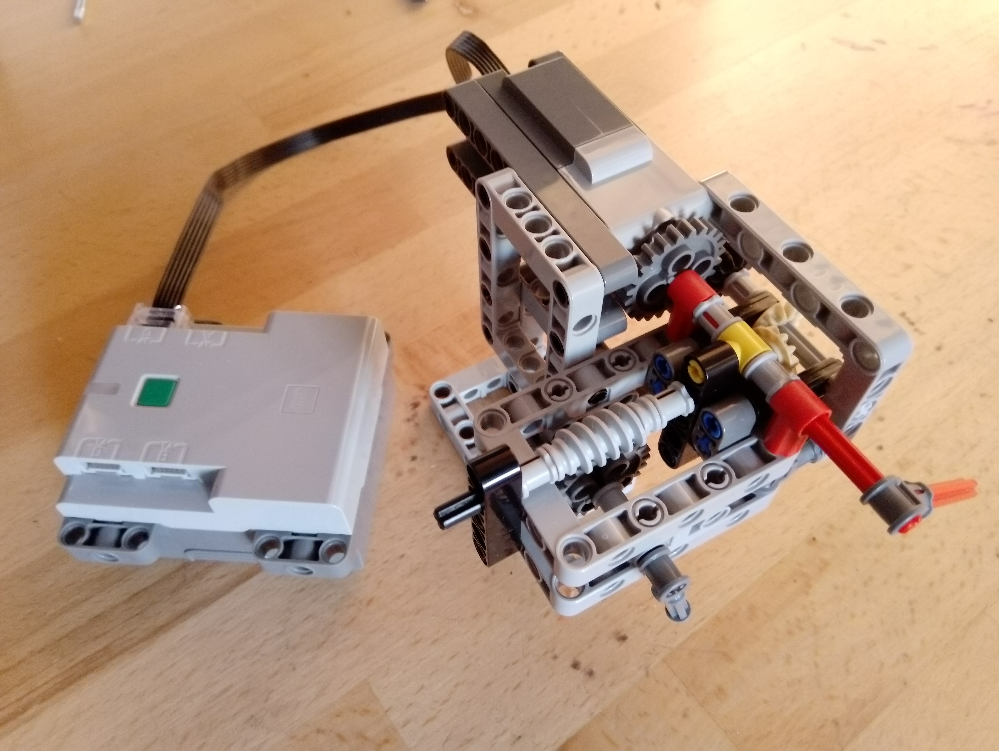

Programowanie Obiektowe v2.0
============================

Plan 
----

   1. wprowadzenie
   2. założenia i pojęcia
   3. projekt (sprzęt)
   4. zakończenie - co należy zapamiętać
   5. Opis plików

Wykład
------

1. Wprowadzenie

  - vscode i terminal
  - OOP - obiekt - połączenie danych i funkcjonalności
  - dlaczego OOP - czytelność, samodokumentowanie, skalowalność - co spróbujemy pokazać

2. Założenia i pojęcia

  - pojęcia

    - obiekt - instancja typu
    - klasa - typ obiektu, type()
    - atrybut - zmienna, która należy do obiektu, dir()
    - rodzaje atrybutów - zwykłe (obiektowe) i klasowe (statyczne)
    - metoda - funkcja, która należy do obiektu
    - rodzaje metod - zwykłe, statyczne, klasowe (@classmethod), wzorzec projektowy Factory
    - konstruktor - specjalna metoda, wywoływana podczas tworzenia obiektu (instancjonowania)
    - metody specjalne - _inst_private, __class_private, __special__
    - przekazywanie obiektu do funkcji - przez wskaźnik

  - pojęcia zaawansowane

    - dziedziczenie - isinstance(), issubclass() 
    - wielokrotne dziedziczenie - depth-first, left-to-right
    - przeciążanie

  - założenia OOP

    - Hermetyzacja (Encapsulation) - stan (dane) i funkcje obiektu są przypisane do obiektu
    - Abstrakcja (Abstraction) - obiekt udostępnia tylko wysokopoziomowy interfejs
    - Dziedziczenie (Inheritance) - umożliwia włączanie funkcjonalności z innych klas
    - Polimorfizm (Polymorphism) - duck typing, "If it walks like a duck and it quacks like a duck, then it must be a duck"

3. Projekt

  3.1 sprzęt i API

  
  
  3.2 pierwsza klasa (pozycja absolutna)
  3.3 użycie klasy
  3.4 klasa zegar
  3.5 użcie klasy zegar
  3.6 drugi zegar
  3.7 próba implementacji proceduralnej (dla porównania)

4. Zakończenie - co należy zapamiętać

  - obiekt, klasa
  - atrybuty, metody
  - sprawne definiowanie klas i tworzenie obiektów
  - konstruktor
  - przeciążanie funkcji
  - proste dziedziczenie

5. Opis plików
  - sandbox.py - kod źródłowy z pierwszej części wykładu
  - main.py - kod źródłowy z drugiej części wykładu
  - hub_wrapper.py - wrapper wokół biblioteki pylgbst służącej do komunikacji z lego
  - requirements.txt - lista bibliotek niezbędnych do działania main.py (pip install -r requirements.txt)
